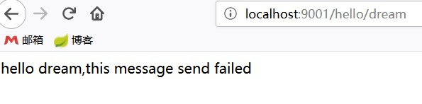

# springCloud demo
[感谢纯洁的微笑](http://www.ityouknow.com)

### eureka
服务注册中心 http://localhost:8090/

### producer
服务提供 http://localhost:9000/hello?name=mm

[0.0.2版本 测试负载均衡](http://www.ityouknow.com/springcloud/2017/05/12/eureka-provider-constomer.html)
然后在浏览器再次输入：http://localhost:9001/hello/neo 进行测试：会发现两种结果交替出现，
说明两个服务中心自动提供了服务均衡负载的功能。如果我们将服务提供者的数量在提高为N个，测试结果一样，
请求会自动轮询到每个服务端来处理。
### consumer
服务调用 http://localhost:9001/hello/dream

注解@EnableFeignClients 依赖 org.springframework.cloud:spring-cloud-starter-openfeign

版本0.0.2[熔断器](http://www.ityouknow.com/springcloud/2017/05/16/springcloud-hystrix.html)
启动consumer 关闭producer 返回hello dream,this message send failed

