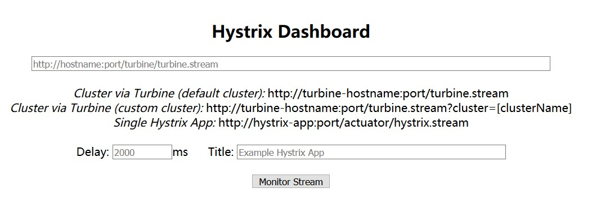
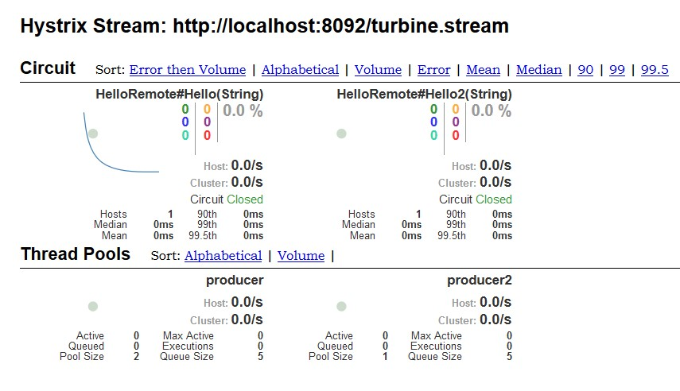

# springCloud demo
[感谢纯洁的微笑](http://www.ityouknow.com)

### eureka
服务注册中心 http://localhost:8090/

端口：8090

### producer

端口：8000

服务提供 http://localhost:9000/hello?name=mm

[0.0.2版本 测试负载均衡](http://www.ityouknow.com/springcloud/2017/05/12/eureka-provider-constomer.html)
然后在浏览器再次输入：http://localhost:9001/hello/neo 进行测试：会发现两种结果交替出现，
说明两个服务中心自动提供了服务均衡负载的功能。如果我们将服务提供者的数量在提高为N个，测试结果一样，
请求会自动轮询到每个服务端来处理。
### consumer
端口：9000

服务调用 http://localhost:9001/hello/dream

注解@EnableFeignClients 依赖 org.springframework.cloud:spring-cloud-starter-openfeign

版本0.0.2[熔断器](http://www.ityouknow.com/springcloud/2017/05/16/springcloud-hystrix.html)
启动consumer 关闭producer 返回hello dream,this message send failed

[熔断监控Hystrix Dashboard](http://www.ityouknow.com/springcloud/2017/05/18/hystrix-dashboard-turbine.html)
- implementation 'org.springframework.cloud:spring-cloud-netflix-hystrix-dashboard'
- implementation 'com.netflix.hystrix:hystrix-javanica'

大概意思就是如果查看默认集群使用第一个url,查看指定集群使用第二个url,单个应用的监控使用最后一个

- 坑：需要一个[bean](https://baike.baidu.com/item/javaBean/529577?fr=aladdin)
    @Bean
    public ServletRegistrationBean getServlet() {
        HystrixMetricsStreamServlet streamServlet = new HystrixMetricsStreamServlet();
        ServletRegistrationBean registrationBean = new ServletRegistrationBean(streamServlet);
        registrationBean.setLoadOnStartup(1);
        registrationBean.addUrlMappings("/hystrix.stream");
        registrationBean.setName("HystrixMetricsStreamServlet");
        return registrationBean;
    } 
###[聚合服务Turbine](http://www.ityouknow.com/springcloud/2017/05/18/hystrix-dashboard-turbine.html)
端口：8092

- 坑 上面的bean中的地址(/hystrix.stream)不要用，不然使用聚合服务时，就检测不到
因为默认的为(/actuator/hystrix.stream)

